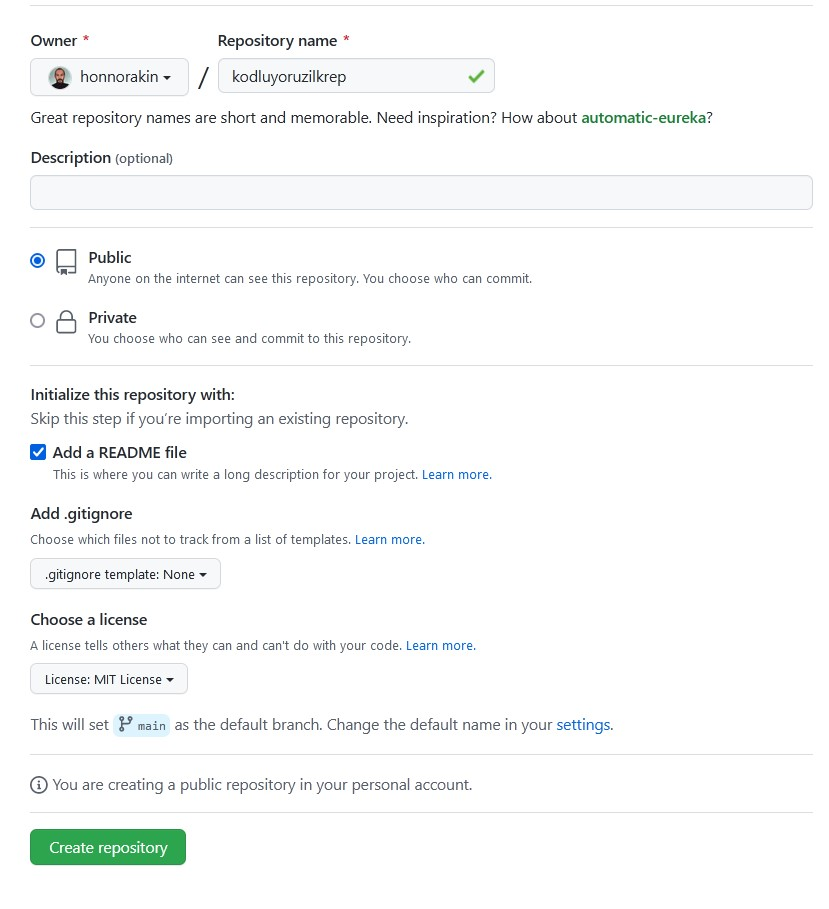

# Kodluyoruzilkrepo

Bu repo [Kodluyoruz](https://www.kodluyoruz.org) Front-End Eğitiminde oluşturduğumuz ilk repo. İçerisinde bir adet README dosyası, bir adet index.html barındırıyor.



## Installation

Öncelikle projeyi clonelayın. [Kodluyoruzilkrepo](https://github.com/honnorakin/kodluyoruzilkrepo.git)

```bash
git clone https://github.com/honnorakin/kodluyoruzilkrepo.git
```

## Usage

Projeyi cloneladıktan sonra Visual Studio Code programında açınız.

sadasdsadasdasdasdasdasdasdasdasdasdsadasd

Linux için:

```bash
cd kodluyoruzilkrepo
code
```

## Contributing

Pull requestler kabul edilir. Büyük değişiklikler için lütfen önce neyi değiştirmek istediğinizi tartışmak için bir konu açınız.

## Licence

[MIT](https://https://choosealicense.com/licenses/mit/#)